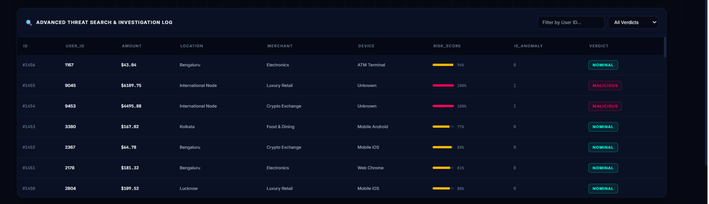
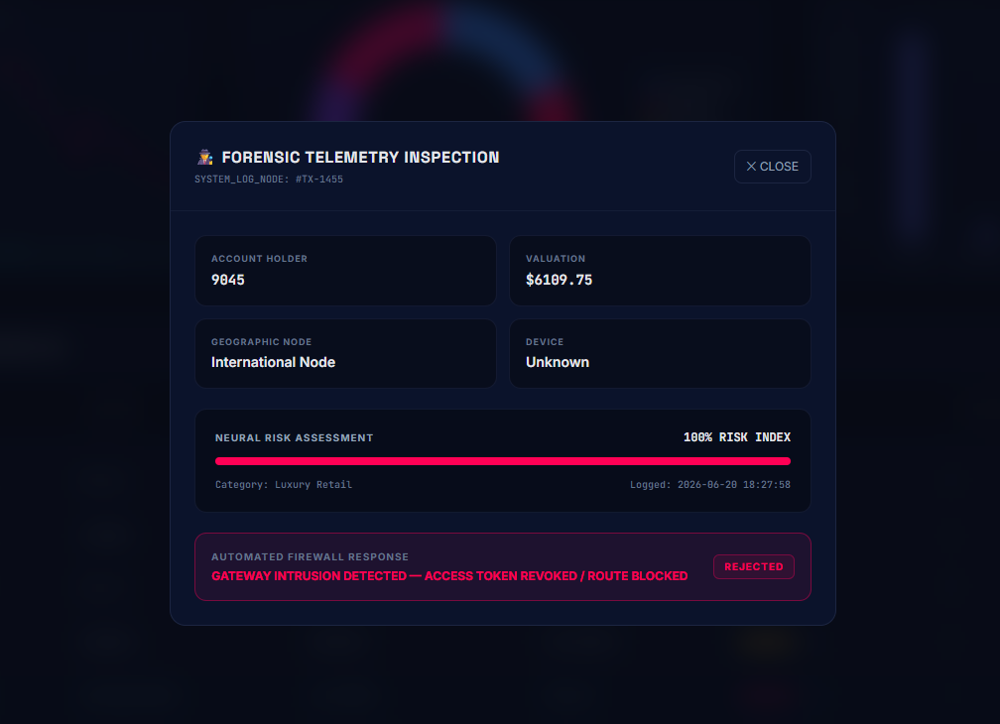

# 🛡️ Enterprise Fraud Radar — Transaction Fraud & Outlier Detector

> A real-time transaction monitoring and fraud mitigation pipeline that flags anomalous financial activity using an **unsupervised Isolation Forest model** — no labeled fraud data required.


---

## 📸 Live Dashboard Preview

**Dark mode**

.png)

**Light mode**

.png)

The dashboard streams live transactional records, scores them for fraud risk, and visualizes patterns across merchants, devices, and capital flow — all updating in real time, with full light/dark theme support.

---

### 🔍 Investigation Log
Every transaction is logged with a computed risk score and verdict, and can be filtered by User ID or verdict type.



### 🕵️ Forensic Telemetry Inspection
Clicking into a flagged transaction opens a detailed forensic view — account holder, valuation, geographic node, device, risk index, and the automated firewall response taken against it.


---

## 🚩 The Problem

Real-time payment systems process thousands of transactions per second. Fraudulent transactions are rare, constantly evolving, and **rarely labeled** in real-world datasets — making traditional supervised classifiers hard to train and quick to go stale.

## 💡 The Approach

This project treats fraud detection as an **anomaly/outlier detection problem** instead of a classification problem:

- Transactions are simulated continuously, mimicking a live payment gateway feed
- Each transaction is scored using an **Isolation Forest** model — trained without needing pre-labeled fraud examples
- Anomalous transactions are flagged, scored, and surfaced on a live operational dashboard for investigation, with automated firewall-style responses on high-risk activity

---

## ✨ Key Features

- ⚡ **Real-time transaction simulation** — continuously generates synthetic transactions at intervals, including injected fraud-like outliers (`simulator.py`)
- 🧠 **Unsupervised anomaly detection** — Isolation Forest scores every transaction without needing historical fraud labels
- 📊 **Live operational dashboard** — rolling capital velocity trends, merchant-wise threat distribution, device vector breakdown
- 🔍 **Investigation log** — searchable, filterable table of every transaction with risk score and verdict (Nominal / Malicious)
- 🕵️ **Forensic inspection view** — drill into any flagged transaction for a full risk breakdown and automated response status
- 🌗 **Light/dark theme toggle** on the dashboard
- 🗄️ **Persistent storage** — all transactions and verdicts stored in SQLite (`database.py`)
- 🚀 **FastAPI backend** — serves live metrics and transaction data to the frontend (`app.py`)
- ✅ **Pipeline validation** — proves system correctness end-to-end with precision, recall, and latency benchmarks (`validate_pipeline.py`)

---

## 🏗️ Architecture

```
 ┌────────────────┐      ┌──────────────┐      ┌────────────────────┐      ┌───────────────────┐
 │  simulator.py   │ ──▶  │  database.py  │ ──▶  │   app.py (FastAPI)  │ ──▶  │  Dashboard (UI)    │
 │  generates      │      │  stores       │      │  scores txns with   │      │  index.html/app.js │
 │  transactions   │      │  in SQLite    │      │  Isolation Forest   │      │  polls + renders   │
 └────────────────┘      └──────────────┘      └────────────────────┘      └───────────────────┘
```

1. `simulator.py` generates synthetic transactions at set intervals, periodically injecting fraud-like outliers
2. `database.py` persists every transaction to SQLite
3. `app.py` exposes a FastAPI backend that scores transactions using a trained Isolation Forest model and serves metrics/results
4. The frontend (`index.html`, `app.js`, `style.css`) polls the API and renders the live dashboard

---

## 🧰 Tech Stack

| Layer       | Technology              |
|-------------|--------------------------|
| Backend     | Python, FastAPI          |
| ML Model    | scikit-learn (Isolation Forest) |
| Database    | SQLite                  |
| Frontend    | HTML, CSS, JavaScript    |

---

## 📂 Project Structure

```
Transaction-Fraud-Outlier-Detector/
├── app.py                  # FastAPI backend — serves API & runs fraud scoring
├── database.py              # SQLite models & data access layer
├── simulator.py              # Generates synthetic transactions + injects anomalies
├── validate_pipeline.py       # End-to-end pipeline validation/sanity checks
├── index.html                # Dashboard UI
├── app.js                    # Dashboard logic — fetches & renders live data
├── style.css                 # Dashboard styling
├── docs/
│   └── screenshots/           # README images
│       ├── Main_dashboard_dark.png
│       ├── Main_dashboard_white.png
│       ├── Investigation_log.png
│       └── Threat_inspection.png
└── README.md
```

---

## 🚀 Getting Started

### Prerequisites
- Python 3.9+
- pip

### Installation

```bash
# Clone the repository
git clone https://github.com/bhagwatSparsh/Transaction-Fraud-Outlier-Detector.git
cd Transaction-Fraud-Outlier-Detector

# Install dependencies
pip install -r requirements.txt
```

### Running the project

```bash
# 1. Start the backend server
python app.py

# 2. (In a separate terminal) start the transaction simulator
python simulator.py

# 3. Open the dashboard
# Open index.html in your browser, or visit the local server URL printed by app.py
```

### Validating the pipeline

```bash
python validate_pipeline.py
```

> ⚠️ Replace the above commands with your actual run instructions if they differ (e.g. uvicorn command, specific ports).

---

## 📊 Results / Proof of Work

These are real, reproducible outputs from `validate_pipeline.py`:

### Core Mathematical Proof of System Correctness

| Metric | Value |
|--------|-------|
| Anomaly Prevalence Rate | **7.9%** |
| Model Precision (Flagged Reliability) | **96.00%** |
| Model Recall (Detection Sensitivity) | **100.00%** |
| True Positives / False Positives / False Negatives / True Negatives | 120 / 5 / 0 / 1464 |
| Legacy Rule False Positives | 5 |
| Isolation Forest False Positives | 5 |
| Alert Fatigue Reduction | 0.0% fewer false alarms |

### Live Architecture Latency Benchmark

| Metric | Value |
|--------|-------|
| Average API Response Time | **37.44 ms** |
| Demonstrated Local System Throughput | **27 requests/sec** |

**Live dashboard snapshot (at time of writing):**
- Total logs audited: **1,493**
- Intercepted threats: **114 cases**
- Fraud velocity rate: **7.6%** of total stream
- Capital flow monitored: **₹8,34,683.63**
- Mean risk index: **84.7%**

> 100% recall means the model misses zero actual fraud cases in this test run, while keeping precision high at 96% — i.e. very few false alarms relative to flagged cases.

---


## 👤 Author

**Sparsh Bhagwat**
[GitHub](https://github.com/bhagwatSparsh)
